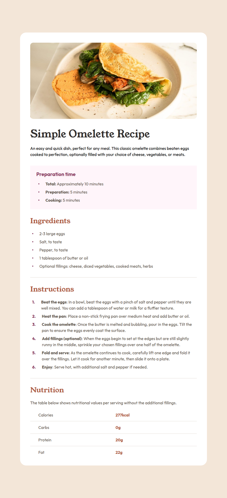

# Frontend Mentor - Recipe page solution

This is a solution to the [Recipe page on Frontend Mentor](https://www.frontendmentor.io/challenges/recipe-page-KiTsR8QQKm).
Frontend Mentor challenges help improve frontend skills by building realistic UI components.

## Table of contents

- [Overview](#overview)
  - [Preview](#screenshot)
  - [Links](#links)
- [Features](#features)
- [My process](#my-process)
  - [Built with](#built-with)
  - [What I learned](#what-i-learned)
- [Setup](#setup)
  - [Installation](#installation)
  - [Development](#development)
  - [Build](#build)
  - [Linting](#linting)
- [Deployment](#deployment)
- [Performance](#performance)
- [Author](#author)
- [Notes](#notes)

## Overview

### The challenge

- Focus on semantic HTML

### Preview



### Links

- Solution URL: [GitHub Repo](https://github.com/vlrnsnk/recipe-page)
- Live Site URL: [Live Site](https://vlrnsnk.github.io/recipe-page/)

## Features

- Responsive layout (mobile-first)
- Accessible interactive states (hover + focus-visible)
- SCSS modular architecture
- CSS property ordering enforced via Stylelint
- Optimized build with Vite
- GitHub Pages deployment via GitHub Actions

## My process

### Built with

- Semantic HTML5 markup
- SCSS (modular architecture: abstracts, base, components, layout)
- CSS custom properties (design tokens via SCSS variables)
- Flexbox / Grid
- Mobile-first workflow
- Vite
- Stylelint (code quality + property ordering)
- HTML validation
- Husky (pre-commit hooks)

### What I learned

- {{LEARNING_1}}
- {{LEARNING_2}}
- {{LEARNING_3}}

## Setup

### Installation

```bash
npm install
```

### Development

```bash
npm run dev
```

### Build

```bash
npm run build
npm run preview
```

### Linting

```bash
npm run lint:scss
npm run lint:html
```

This project uses Stylelint + EditorConfig + Husky pre-commit hooks
to ensure consistent code formatting before commits.

### Fix linting issues:

```bash
npm run lint:scss:fix
npm run lint:html:fix
```

## Deployment

Project is built with Vite and deployed to GitHub Pages using GitHub Actions.

## Performance

Lighthouse score (example):

- Performance: {{PERF_SCORE}}
- Accessibility: {{ACCESSIBILITY_SCORE}}
- Best Practices: {{BEST_PRACTICES_SCORE}}
- SEO: {{SEO_SCORE}}

## Author

- Website: https://vlrnsnk.com
- Frontend Mentor: https://www.frontendmentor.io/profile/vlrnsnk
- GitHub: https://github.com/vlrnsnk

## Notes

- Focus on accessibility (semantic HTML, focus-visible)
- Modular SCSS architecture using @use
- Consistent styling via Stylelint rules
- Optimized build pipeline with Vite
